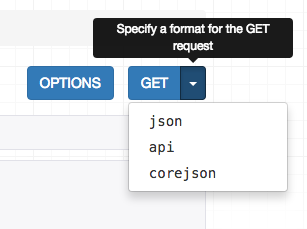

# Tutorial 7: 概要和客户端库

概要是一种机器可读文档，用于描述可用的API路径，其URLS以及它们支持的操作。

概要可以是自动生成文档的有用工具，也可以用于驱动可以与API进行交互的动态客户端库。

## Core API

为了提供概要支持REST框架使用[Core API][coreapi]。

Core API是用于描述API的文档规范。它用于提供可用路径的内部表示形式和API公开的可能的交互。它可以用于服务器端或客户端。

当使用服务器端时，coreAPI允许API支持呈现范围广泛的概要或超媒体格式。

当使用客户端时，核心API允许动态驱动的客户端库，它可以与任何公开受支持的概要或超媒体格式的API交互。

## 添加概要

REST框架支持明确定义的概要视图或自动生成的概要。由于我们使用的是视图集和路由器，我们可以简单地使用自动概要生成。

你需要安装`coreapi` python包才能包含API概要。

    $ pip install coreapi

现在我们可以通过在URL配置中包含一个自动生成的概要视图来为API添加概要。

    from rest_framework.schemas import get_schema_view

    schema_view = get_schema_view(title='Pastebin API')

    urlpatterns = [
        url('^schema/$', schema_view),
        ...
    ]

如果你在浏览器中访问API根路径，那么你现在应该可以看到`corejson`表示形式是一个可用选项。

我们也可以通过在`Accept`标头中指定所需的内容类型从命令行请求概要。

    $ http http://127.0.0.1:8000/schema/ Accept:application/coreapi+json
    HTTP/1.0 200 OK
    Allow: GET, HEAD, OPTIONS
    Content-Type: application/coreapi+json

    {
        "_meta": {
            "title": "Pastebin API"
        },
        "_type": "document",
        ...

默认输出样式是使用[Core JSON][corejson]编码。

还支持其他概要格式，如[Open API][openapi]（以前叫Swagger）。

## 使用命令行客户端

现在我们的API暴露了一个概要路径，我们可以使用一个动态的客户端库与API进行交互。为了演示这个，我们来使用Core API命令行客户端。

命令行客户端作为一个`coreapi-cli`包提供：

    $ pip install coreapi-cli

现在检查它在命令行上是否可用...

    $ coreapi
    Usage: coreapi [OPTIONS] COMMAND [ARGS]...

      Command line client for interacting with CoreAPI services.

      Visit http://www.coreapi.org for more information.

    Options:
      --version  Display the package version number.
      --help     Show this message and exit.

    Commands:
    ...

首先，我们将使用命令行客户端加载API概要。

    $ coreapi get http://127.0.0.1:8000/schema/
    <Pastebin API "http://127.0.0.1:8000/schema/">
        snippets: {
            highlight(id)
            list()
            read(id)
        }
        users: {
            list()
            read(id)
        }

我们还没有认证，所以现在我们只能看到只读路径，这与我们设置的API权限是一致的。

我们使用命令行客户端，尝试列出现有的代码片段：

    $ coreapi action snippets list
    [
        {
            "url": "http://127.0.0.1:8000/snippets/1/",
            "id": 1,
            "highlight": "http://127.0.0.1:8000/snippets/1/highlight/",
            "owner": "lucy",
            "title": "Example",
            "code": "print('hello, world!')",
            "linenos": true,
            "language": "python",
            "style": "friendly"
        },
        ...

一些API路径需要命名参数。例如，要获取特定代码片段的高亮HTML表示，我们需要提供一个id。

    $ coreapi action snippets highlight --param id=1
    <!DOCTYPE html PUBLIC "-//W3C//DTD HTML 4.01//EN" "http://www.w3.org/TR/html4/strict.dtd">

    <html>
    <head>
      <title>Example</title>
      ...

## 验证我们的客户端

如果我们想要创建，编辑和删除代码片段，我们需要进行有效性用户身份验证。在这种情况下，我们只需使用基本的auth。

请确保使用实际的用户名和密码替换下面的`<username>`和`<password>`。

    $ coreapi credentials add 127.0.0.1 <username>:<password> --auth basic
    Added credentials
    127.0.0.1 "Basic <...>"

现在，如果我们再次提取概要，我们应该能够看到一组可用的交互。

    $ coreapi reload
    Pastebin API "http://127.0.0.1:8000/schema/">
        snippets: {
            create(code, [title], [linenos], [language], [style])
            delete(id)
            highlight(id)
            list()
            partial_update(id, [title], [code], [linenos], [language], [style])
            read(id)
            update(id, code, [title], [linenos], [language], [style])
        }
        users: {
            list()
            read(id)
        }

我们现在能够与这些路径行交互。例如，要创建一个新的代码片段:

    $ coreapi action snippets create --param title="Example" --param code="print('hello, world')"
    {
        "url": "http://127.0.0.1:8000/snippets/7/",
        "id": 7,
        "highlight": "http://127.0.0.1:8000/snippets/7/highlight/",
        "owner": "lucy",
        "title": "Example",
        "code": "print('hello, world')",
        "linenos": false,
        "language": "python",
        "style": "friendly"
    }

然后删除一个代码片段：

    $ coreapi action snippets delete --param id=7

除了命令行客户端，开发人员还可以使用客户端库与你的API进行交互。Python客户端库是第一个可用的库，并且计划即将发布一个Javascript客户端库。

有关定制模式生成和使用Core API客户端库的更多详细信息，您需要参考完整的文档。

## 回顾我们所做的

使用非常少的代码，我们现在有一个代码收集系统的webAPI，它是完全的浏览器可浏览的，包括一个概要驱动的客户端库和带有身份验证、每个对象的权限控制和多个渲染器格式支持。

我们已经走过了设计过程的每个步骤，并且看到如果我们需要自定义任何东西，我们都可以按部就班的简单地使用常规的Django视图实现。

你可以查看GitHub上的[最终教程代码][repo]，或者尝试下[沙箱中][sandbox]的实例。

## 越来越成功

我们已经完成了我们的教程。如果你想要更多地参与到REST框架项目中，以下是你可以开始的几个地方：

* 通过审查和提交问题，并pull requests，为[GitHub][github]做出贡献。
* 加入[REST framework 讨论组][group]，并帮助构建社区。
* 在Twitter成为[作者][twitter]的粉丝，并打个招呼。

**现在就去构建非常棒的东西吧。**

[coreapi]: http://www.coreapi.org
[corejson]: http://www.coreapi.org/specification/encoding/#core-json-encoding
[openapi]: https://openapis.org/
[repo]: https://github.com/tomchristie/rest-framework-tutorial
[sandbox]: http://restframework.herokuapp.com/
[github]: https://github.com/tomchristie/django-rest-framework
[group]: https://groups.google.com/forum/?fromgroups#!forum/django-rest-framework
[twitter]: https://twitter.com/_tomchristie
